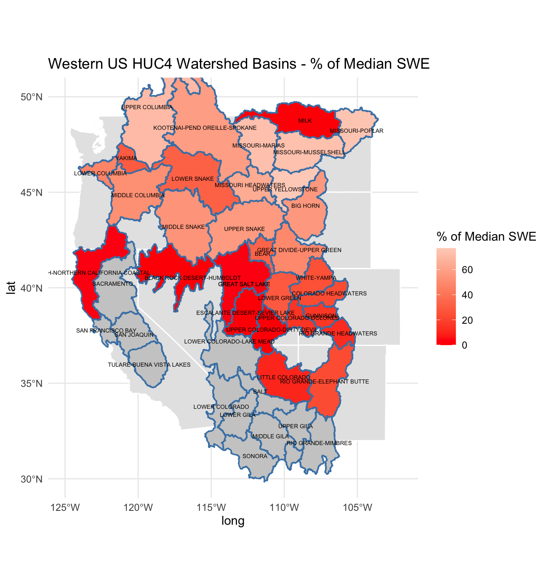

## Main Focus and Question of this Project

Snow Water Equivalent (SWE) is the measurement of how many inches of water exist in fallen snow. This is one of the most accurate ways for weather analysts to observe non-winter water levels and predict drought.

My main focus of this project was to create an app that synthesizes western United States SWE data and predicts drought. I was principally inspired by my trip to the San Juan River this past March and the impact that snow, and lack there of, impacts the ecosystems as well as recreation.

## Data Introduction

There are two main locations that I sourced my data from were Natural Resource Conservation Service and using Rstudio to pull the Western HUC4 region data. Luckily it was as easy as pulling the tables via URL and using prexisting R services that examine these watersheds.

Natural Resource Conservation Service measures national water and environmental data through sensors and stations, for researches and students alike can access the data for projects. Measuring soil, water, fauna, and floral this service was the most helpful for this project.

## Graphic

