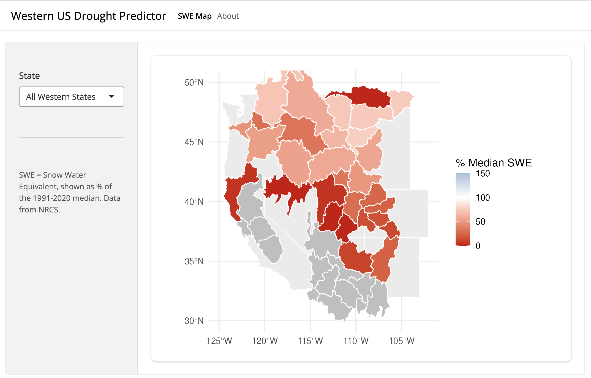

## Abstract and Data

After my Outing Program River Dynamics Course, which took us river rafting in Utah, I became particularly inspired to create an app that uses snow water equivalent data to predict drought. Using data from Natural Resources Conservation Service, specifically the variables SWE_pct_median and name, I reframed and joined my data to then create a plot, which I finally transformed into a shiny app. I did this to further my data visualization skills while also investing time into something that I am generally interested in. After completing my app, I found that most unsurprisingly, due to increased global temperature and lack of precipitation it is extremely likely that there will be significant drought in the agricultural cradle of the United States this year.

## Essential Goal

The main goal of this project was to create a shiny app that allows for drought prediction in the Western United States, based off of the previous winter's total snow water equivalent.

## Finished App Renderings

